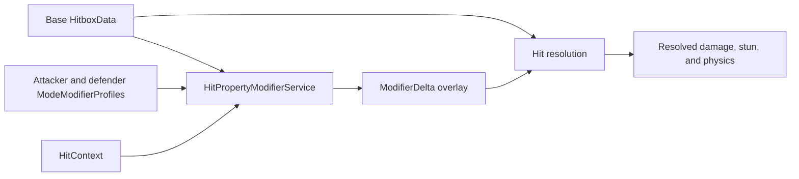
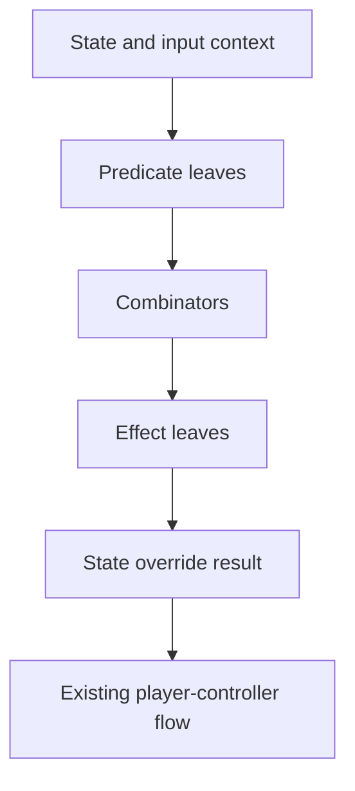

Throughout my development career, I have heard the same warning in different forms: do not spend too much time building editor tools.

The advice is understandable. A custom inspector does not show up in a trailer. A code generator does not make the build fun by itself. An editor window can feel like infrastructure for a problem that has not been proven yet. If players never touch it, why spend time polishing it?

I have found the opposite to also be true.

Editor tooling is not automatically valuable. A bad tool can add another layer of ceremony, hide the source of truth, or create a second version of the runtime that eventually drifts. But when a project has dense authored data or an expensive testing loop, the editor becomes part of the product's authoring interface.

That was the lesson I took from two projects: `FakeFighter`, which grew out of the project formerly called Athens Core, and `PersonalVROnboarding`.

The projects had different problems. FakeFighter's central issue was authoring density. A character was already a huge object, and every new mechanic made that object longer, more interconnected, and harder to test. PersonalVROnboarding's central issue was physical iteration. The authored data described a sequence of actions that had to be performed in VR, where restarting a test carried a real setup cost.

In both cases, editor tooling made each system more composable, more observable, and faster to change.

## Editor tooling addresses the cost around the test

For an authored feature, the useful loop is not only “write code, then run the game.” It is closer to:

Without tooling, every iteration pays the same setup tax: find the data across several files, remember conventions that may not be written down, enter Play Mode, and infer the cause of a problem from runtime output. None of that work improves the feature itself, but all of it is repeated whenever the feature changes.

The most useful editor tools remove one specific part of that tax. A visualizer turns dense data into something an author can read. A property drawer puts the preview beside the values being edited. A validator checks relationships before they become runtime failures. A generator handles repetitive type and ID declarations. A save hook keeps multiple representations aligned. A telemetry view turns a vague runtime impression into a measurable result.

The value compounds because the tool is used every time the loop is repeated, not only once when it is written.

---
## FakeFighter: reducing authoring density

FakeFighter did not begin with one clean tooling problem. The problems appeared as the game became more ambitious.

Characters were the first pressure point. The difficulty was not that any one field was especially complicated. It was the density of the whole character. There was more data to understand, more behavior to test, and less room to make a change without wondering what else it might affect. On top of that, every new mechanic made that object longer and added another relationship to keep in mind.

Projectiles created a different kind of problem. They behaved like small characters with their own lifecycles, but each projectile could have a completely different state machine. A charge projectile needed a charge state and serialized state that could be reconstructed deterministically over the network. A multi-hit projectile had different timing and collision behavior on the same state machine but posed interesting authorship problems. The work there was less about making a huge character asset readable and more about removing the repetitive coding and bookkeeping around each unique state machine.

Looking back at Fake Fighter’s history, its architecture feels less like the result of a carefully executed plan and more like a record of the project gradually uncovering the limits of each representation as it evolved.

The tools were not all addressing the same problem; instead, each emerged in response to a different kind of authoring friction that surfaced as the game expanded.
### 1. The giant static data phase

Early character data was represented as JSON and loaded as a giant in-memory static blob. That made it possible to centralize the data, but it also meant the game used more memory than it needed. More importantly, live changes were fragile because a specific chunk of the game's behavior depended on one large static representation meaning that domain forced tedious recompilations.

Hitboxes were the clearest example of the cost of the original authoring workflow. There was no practical way to preview them outside the running game. Understanding an attack required launching the game and observing the result, but there was no way to step through the animation frame by frame while inspecting the authored data. The alternative was to examine what was effectively a large JSON spreadsheet and mentally reconstruct how the values would combine.

This is fundamentally a density problem. Each individual value is straightforward, but the sheer number of values and their relationships make the raw representation difficult to reason about when fine tuning an attack's frame data. The information is present, but it is not represented in a form that supports efficient editing.

The workflow also imposed a significant cognitive cost. Every adjustment required stopping the current test, waiting for the editor to reload, recreating the relevant game state, and then trying to recall how the previous version felt. Those repeated context switches made even small iterations more mentally demanding than they needed to be.
### 2. Rebuilding the authoring surface

Fake Fighter's later architecture rebuilt the game around data that could be edited more directly. Character data moved into ScriptableObject assets that could be inspected and changed in Unity. Editor drawers could interpret that data without requiring a live player controller. Addressables could separate authored content from the initial runtime build and support the content-publishing workflow described in [[Addressables, ScriptableObjects, and Manifest Design]].

The practical effect was much larger than “the data is now in assets.” The game could stay in Play Mode while data was adjusted. Hitboxes and hurtboxes could be previewed in the editor, and data-only changes could be tested without recompiling code. The authoring loop became closer to:

1. Open the character asset.
2. Scrub to the relevant animation frame.
3. See the sprite, hitboxes, and hurtboxes together.
4. Adjust the data.
5. Observe the result in the running game.

#### Previewing collision data

`HitboxGroupDrawer` and `HurtboxGroupDrawer` place frame controls and visual previews directly alongside authored data. Behind the scenes, `HitboxEditorUtility` resolves the exact sprite from animation data while determining active collision regions for any given state and frame. Because the visualizer mirrors the underlying domain model, what you author in the inspector is guaranteed to be what actually executes in-game.

Overall, it’s a night and day difference. The boost in iteration speed completely changed how I worked, giving me the confidence to play a bit looser and make deep architectural changes in a single pass.
### Modifiers instead of duplicated attacks

The improvements to hitbox authoring exposed the next problem. One character had a set of core attacks, but I wanted those same attacks to gain small, meaningful additions whenever the character entered an upgraded state. Certain existing hitboxes needed extra properties, but only while that state was active.

The obvious solution was to create another version of each attack: copy the base hitbox data and fill in the upgraded values. That would have made the editor look straightforward in the short term, but it would have created two versions of the same attack. Every change to the base would raise the question of whether the upgraded copy had been updated too. It also would have pushed upgrade-specific fields into `HitboxData`, forcing every character to carry data that most of them would never use.

Instead, I separated the base hitbox from the changes that can be applied to it. This is similar in spirit to [CQRS (Command Query Responsibility Segregation)](https://martinfowler.com/bliki/CQRS.html): the base model describes the authored attack, while a separate modifier pipeline describes contextual effects that are resolved when the hit occurs.

`HitboxData` remains focused on the attack itself. It does not need to know every possible combat mode or upgrade rule. Those rules live in a `ModeModifierProfile`, which can contain global effects and targeted rules. A `TargetedModifierRule` can select hits by their source state, their computed index within a hitbox group, whether they are projectiles, and whether the hit is a counter hit.

The effects themselves implement `IModifierEffect`. They do not rewrite the hitbox. They receive the hitbox and the current `HitContext`, then add their contribution to a `ModifierDelta`. The available effects can add damage, change hitstun or blockstun, modify knockback, reduce incoming damage, or provide other contextual changes without changing the underlying hitbox asset.

At runtime, hit resolution creates a context containing the active combat mode, counter-hit state, and projectile status. It resolves the attacker's profile and the defender's profile, then passes both through `HitPropertyModifierService`.

The editor still had to make that split practical. `ModeModifierProfileDrawer` adds the profile controls to the character asset and gives each profile a copy toolbar. `CombatModeProfileCopyUtility` deep-copies the effects and targeted rules while preserving the destination profile's `modeId`. That made it possible to create a related combat mode from an existing one without accidentally sharing the same nested lists.

That became useful once a character had more than one mode with similar behavior. I could copy a profile, change the few effects that differed, and keep the modes independent. It was a much safer starting point than rebuilding a long serialized structure by hand.

The separation also introduced a cost that the runtime design did not remove. The hitbox preview and the combat-mode profile lived in different parts of the inspector. I would author the attack, scrub through its hitboxes, and then move to the profile to describe which of those hits should change in the upgraded state. The data was cleaner, but I still had to carry the connection between those two views myself.

State overrides made that connection even more important. A modifier can target a source state or a computed hitbox index within a group. If an override changes which state produces the hit, adds or removes a hitbox, or changes the order in which the group is evaluated, the modifier profile may need another pass. The base hitbox can still look correct in its own preview while the modifier is now pointing at the wrong thing.

That is the tradeoff in this kind of composition, and it is the part I would like to address with a node-based editor in the future. The ideal authoring surface would show the base hitbox, the combat-mode modifier, and any state overrides as one connected chain. A designer should be able to follow a hit from its authored shape through every contextual change and preview the final result without manually reconstructing the relationship between separate inspector panels.

The current editor is not there yet, but it has made the missing UX much clearer to me. The next version should make those dependencies visible, and informs me on what expectations I need to aim for when making a similar feature for games in the future.

### 3. Making behavior composable with state overrides

Building off of combat modifiers as a concept, the next question was whether an existing player state could change behavior without rewriting the `PlayerController` state machine, a class that needs clear determinism.

That led to state overrides.

An override can change selected behavior that the player controller has already determined. Rather than replacing the entire state machine, it supplies additional decisions around the existing state. The system defines small primitives, called leaves, that represent individual game-design decisions. Combinators combine those leaves into larger rules.

A leaf might inspect a state, input, counter, projectile condition, or other piece of context. Another leaf might apply an effect, change a value, or trigger a transition. A combinator can express conditions such as “all of these are true,” “if this then that,” or “run these actions in sequence.” The power comes from the combinations rather than from any single primitive.

This is where the editor tooling became a design tool rather than only a debugging tool. Once leaves and combinators were available as authored pieces, a character revision could be expressed as a new combination of existing pieces instead of requiring new code for every variation.

That has an important downstream benefit. The same authored character revision can be packaged as content rather than being inseparable from an engine change. This is the same broader separation described in [[Addressables, ScriptableObjects, and Manifest Design]]: authored data, loadable assets, content editions, and runtime code can each have a distinct responsibility.

The result is not that code disappears. The primitives and interpreter still need to be designed and implemented. The payoff is that once the vocabulary exists, the next character revision can often be made by composing existing leaves in the editor.

#### Special moves as blank-slate states

State overrides eventually became useful for special moves as well.

A special move can be treated as a blank-slate state whose behavior is assembled through the same override system. It does not need a completely separate hard-coded implementation for every variation. The state can use the existing override machinery to express the behavior required at that point in the character's design.

That makes a special move less like a one-off code path and more like a composition of decisions:

- what state or input starts it;
- what movement or physics it applies;
- what hitboxes or projectiles it creates;
- how it reacts to counters or context;
- what happens when its sequence completes.

Those decisions can be represented by leaves and combined through the same authoring model used for overrides on existing states.

This matters because special moves are exactly the kind of feature that makes a character asset grow uncontrollably. If every new move requires another bespoke implementation, the amount of code and configuration eventually becomes impossible to manage. A new move should describe what makes it different, not recreate every system it happens to use.

Editor tooling made that approach practical. The editor could expose the available primitives, show their parameters, and let me assemble them directly on the character asset. The runtime then interpreted the resulting structure through the same override system as the rest of the character removing my earlier nightmares of waiting for static recompiles on each special move change.

### 4. Projectiles: a separate coding and determinism problem

Projectiles belonged to the same project, but their tooling solved a different problem. This was less about authoring density and more about coding overhead and deterministic state.

A projectile is “kind of like a character” in the sense that it has a lifecycle loop: it is created, updated, can collide, can transition, and eventually expires. But each projectile can have a unique state machine. A charge projectile may need a charge state with its own serialized value. A multihit projectile may need different timing and hit rules. A proximity projectile may have its own guard behavior.

For a deterministic networked game, those states cannot be informal. The state that exists at one simulation tick must be serializable and reconstructible by the other peer. State names, IDs, transitions, and snapshot data need to agree with the code that executes them.

That is why `ProjectileStateDesigner` exists.

The editor is an authoring surface for projectile kinds and their state schemas. From that schema, the project can generate the `ProjectileID` enum and the state-related declarations used by the runtime. The tool saves people from repeatedly retyping identifiers, generic state types, and schema metadata, while still keeping the behavior of each state in handwritten code where it belongs.

The point is not to generate the projectile's behavior. The point is to remove the bookkeeping around the behavior so the developer can focus on what the charge state or multihit state should actually do.

---
## Making a VR sandbox

My contract work on a VR project approached editor tooling from a different direction. I was using it to answer sandbox-design problems as they appeared: how should a task be represented, how should a scene object be connected to it, and how should the system know that the player had actually completed it?

>[!NOTE]
>The contract involved more than editor tooling. I also worked on the VR interactions themselves; look forward to a future article about that side of the project.

Without an authoring surface, those answers tend to spread across fragile references and a chain of managers that each own one more piece of the process. That kind of layering is easy to introduce and difficult to remove. A new requirement can become another reference, another coordinator, and another place where the intended relationship is implied rather than visible.

The editor gave me a place to make those relationships explicit. Instead of solving every onboarding problem by adding another manager or relying on a reference that could silently break, I could represent the procedure and its connections directly in authored data. The result was not that the system had no runtime code. It was that the runtime code had a clearer structure to interpret.

I started with a `GameplayRecipe` ScriptableObject. From Unity's asset menu, I could create an onboarding recipe, arrange mandatory and optional tasks in the inspector, and give each step a stable GUID. The asset stayed organized around the way a person thinks about a procedure, while the runtime built a lookup table so it could resolve a step without repeatedly walking the entire hierarchy.

That separation let the same data serve two different purposes. The inspector showed the procedure as a sequence of tasks and sub-tasks. The runtime saw an indexed set of definitions it could query during play.

I wanted the editor to make the runtime relationships visible before I put the headset on. The available fields, dropdowns, and bindings showed which objects belonged to which steps, what data a task expected, and where validation fit into the sequence. The editor became a map of the system I was building rather than another place to hide its complexity.
### Telemetry outside the headset

The live telemetry drawer extended that idea into Play Mode. During a running simulation, the editor could display sequence timing and step state: overall elapsed time, active countdowns, and completion durations.

That information could have been rendered inside the VR scene, but keeping it in the editor made the test more honest. The headset continued to show the final UX and UI rather than a layer of debug geometry and labels, while the editor explained what the system believed was happening.

That separation also helped when the procedures and deliverables changed midway through the contract. The authored structure could be rearranged as the requirements shifted, and I could continue inspecting the underlying task state without turning every temporary design question into player-facing UI. The editor gave me a flexible place to observe the system while the headset remained focused on the experience being built.

## Two projects, two reasons tooling paid off

These projects made the value of tooling clear to me for different reasons. FakeFighter needed a way to make a dense character authoring surface navigable. ScriptableObjects gave the data an editor-native home, hitbox drawers made time and space visible, modifiers and state overrides let new behavior describe its differences, and projectile code generation removed repetitive schema work without taking behavior away from the programmer.

My contract work on the VR project had a different cost. The difficult part was keeping a changing procedure understandable while testing it through a headset. Recipe assets, stable GUIDs, validators, telemetry, and hot reload gave me places to express those relationships through a sandbox environment reducing the amount of friction to wire up a scene.

In both cases, the editor became a representation of the systems the project actually contained. It wasn't about hiding fields [although if you find a script is slowing your inspect please do that,] or making it a "prettier to look at" it was to build the game right.

## The broader lesson

That does not mean every repeated action deserves a custom window. The useful question is whether the tool addresses a real source of cost:

- Is the authored data too dense to understand from raw fields?
- Do multiple representations need to stay synchronized?
- Does every new mechanic require copying an entire existing structure?
- Does a typo become a runtime-only failure?
- Is the test loop expensive to reconstruct?
- Can a repeated design decision become a reusable primitive?
- Can the editor preview the same domain data that the runtime uses?

The editor is where a project explains itself to the people building it. When that explanation is clear, the project becomes easier to change without becoming easier to break.

That is why editor tooling is not a waste of time.

---

<!-- letter-outro -->
There's more to build.

_Ciao,_

**KG**
<!-- /letter-outro -->
